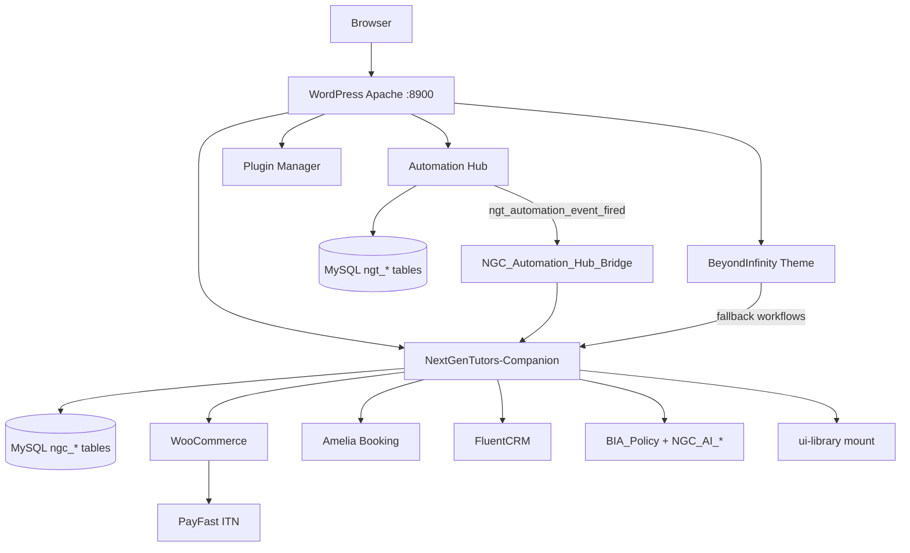
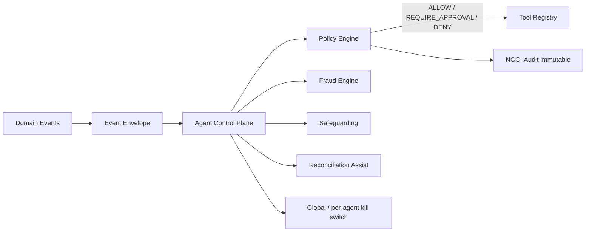

# 02 — Architecture Current State

**Evidence:** source inspection 2026-07-20. Speculative items marked NOT VERIFIED.

## Component diagram (current)

## Trust boundaries

| Boundary | Components | Risk |
|----------|------------|------|
| Public web | Theme pages, shortcodes, REST public routes | XSS, form abuse |
| Authenticated user | Dashboards, bookings, child data | IDOR / minor PII |
| Admin | Companion admin, Hub admin, AI Suite | Privilege escalation |
| Payment provider | PayFast ITN webhook | Signature/replay |
| AI egress | BYOK model HTTP | PII leakage — mitigated PARTIAL by `BIA_Policy::redact` |

## Target architecture (governed agents)

## Critical coupling

| Issue | Status | Action |
|-------|--------|--------|
| Theme ↔ Companion workflow duplication | PARTIAL | Prefer Companion; theme fallback only |
| Hub ↔ Companion matching/payouts duplication | FINANCIAL CONTROL RISK | Unify via bridge; disable duplicate cron when Companion active |
| Dual UI stacks | PARTIAL (ADR-002) | Keep coexistence |
| Legacy nextgen-tutors-core | DEPRECATED | Guard deny VERIFIED prior |

## Refactoring order

1. Agent control plane + policy + kill switch  
2. Fraud + safeguarding case foundations  
3. Event envelope on Hub/Companion fire paths  
4. Unify payout cron ownership  
5. Observability metrics export  
6. UI Agent Ops Centre  
