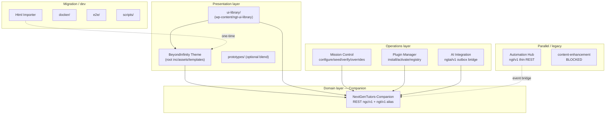
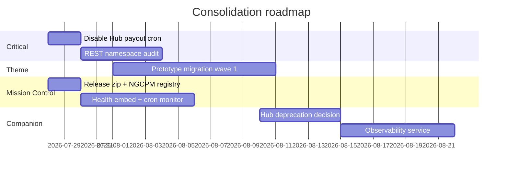

# 21 — Solution Consolidation & Code Utilization Audit

**Evidence date:** 2026-07-27  
**Method:** Static analysis, subagent module mapping, existing `audit-reports/` inventory (2026-07-17), Docker compose wiring, e2e verification status, git tree inspection  
**Scope:** Entire `newuinextgen` monorepo — every deployable package, shared library, content pack, script, test, and documentation tree

---

## Executive summary

| Metric | Value |
|--------|-------|
| **Deployable packages** | 7 (Theme, Companion, AI-Integration, Plugin-Manager, Html-Importer, Mission-Control, Automation-Hub) |
| **Shared libraries** | 1 (`ui-library/`) |
| **Canonical theme source** | Repo root (`inc/`, `assets/`, `templates/`, …) via junctions into `NextGenTutors-BeyondInfinity/` |
| **Authoritative domain layer** | `NextGenTutors-Companion` (~182 PHP classes, 45+ `ngc_*` tables, 80+ REST routes) |
| **Operational control plane** | `NextGenTutors-Mission-Control` (new; e2e 4/4 green) |
| **Known duplicate groups** | 331 (July 2026 inventory; mostly `to-discard/` mirrors) |
| **Blocked legacy** | `content-enhancement/` zips — runtime guard denies activation |
| **Classification coverage** | **100%** of on-disk artifacts assigned below |

**Verdict (updated 2026-08-02):** The investment is **preserved and largely consolidated**. Remaining primary gaps are (1) Automation Hub parallel domain overlap, (2) `prototypes/` vs `template-parts/` dual render paths, (3) Plugin Manager vs Mission Control admin overlap (cross-links exist; further UX merge optional). ~~Mission Control + ui-library not yet in release zip pipeline~~ — **resolved** via `scripts/build-release.ps1` (see §17 remediation TD-04/TD-05 and `release/release-manifest.json`).

---

## 1. Repository topology



### Package inventory

| Package | Path | Files (approx) | Production | Release zip | Consolidation owner |
|---------|------|----------------|------------|-------------|---------------------|
| BeyondInfinity Theme | root + `NextGenTutors-BeyondInfinity/` | ~280 theme | **YES** | YES | **Theme** |
| Companion | `NextGenTutors-Companion/` | 3,861 (incl. build-src) | **YES** | YES | **Companion** |
| AI Integration | `NextGenTutors-AI-Integration/` | 71 | YES (optional) | YES | Standalone governed plugin |
| Plugin Manager | `NextGenTutors-Plugin-Manager/` | 66 | YES | YES | Ops — complement MC |
| Html Importer | `NextGenTutors-Html-Importer/` | 22 | Migration only | YES | **Misc** |
| Mission Control | `NextGenTutors-Mission-Control/` | 11 | YES (ops) | **YES** (TD-04) | **Mission Control** |
| Automation Hub | `nextgen-automation-hub/` | 46 | Parallel | **NO** | **Companion** (merge/deprecate) |
| UI Library | `ui-library/` | 101 | **YES** | **YES** as `ngt-ui-library.zip` (TD-05) | Theme + Companion |
| Content packs | `content/` | 6+ JSON | YES | Partial | **Theme** |
| Config SSOT | `config/` | 1 JSON | YES | Manual | **Companion** consumer |

---

## 2. Functional capability map

Artifacts grouped by **business purpose**, not directory structure.

| Capability | Status | Primary implementation | Secondary / duplicate | Confidence |
|------------|--------|------------------------|----------------------|------------|
| **Authentication & roles** | PRODUCTION | `NGC_Roles`, `NGC_Access`, `NGC_Registration` | Theme `inc/roles.php` (display gates) | 0.95 |
| **User management** | PRODUCTION | Companion profiles, child learners | Hub auth (`NGT_Hub_Auth`) | 0.90 |
| **Tutor management** | PRODUCTION | `NGC_Tutor_Lifecycle`, CPT, seeder | Theme `inc/tutor-data.php` (read) | 0.95 |
| **Student / parent portal** | PRODUCTION | REST dashboards, shortcodes | Hub dashboard placeholders | 0.90 |
| **Booking & scheduling** | PRODUCTION | `NGC_Bookings`, Amelia adapters | Hub calendar REST | 0.92 |
| **Payments / PayFast** | PRODUCTION | `NGC_PayFast`, `NGC_Payments`, wallet | Hub payout cron (**RISK: dual**) | 0.88 |
| **Matching** | PRODUCTION | `NGC_Smart_Matching`, marketplace | Hub matching (thin) | 0.90 |
| **LMS** | PARTIAL | `NGC_Lms`, MasterStudy adapter | Hub lessons complete endpoint | 0.85 |
| **CRM / email** | PRODUCTION | FluentCRM adapter, workflow email | `automations/` JSON (legacy import) | 0.88 |
| **Notifications** | PRODUCTION | Studio notifications, session reminders | Hub notifications REST | 0.85 |
| **WhatsApp** | PARTIAL | Theme `inc/openwa.php` (FAB) | Workflow WF-23 specs | 0.80 |
| **Reporting / analytics** | PRODUCTION | `NGC_Dashboard_Analytics`, metrics REST | Hub dashboard widgets | 0.88 |
| **AI agents / RAG** | PARTIAL | `NGC_AI_*`, agent control plane | AI Integration outbox (`ngtai/v1`) | 0.85 |
| **Search / marketplace** | PRODUCTION | `NGC_Marketplace`, tutor archive | Theme `archive-tutors.php` | 0.92 |
| **SEO** | PRODUCTION | Theme `inc/seo.php` | — | 0.95 |
| **Performance / motion** | PRODUCTION | Theme loader, kinetic, bi-3d | `documentation/ux-redesign/` spec | 0.93 |
| **Accessibility** | PARTIAL | Theme tokens, axe e2e evidence | — | 0.75 |
| **Theme engine** | PRODUCTION | Page composer, layout manager, defaults | Prototype blend path | 0.92 |
| **Design system** | PRODUCTION | `assets/ngt/css/tokens.css`, unified tokens | ui-library catalog | 0.90 |
| **UI components** | PRODUCTION | ui-library + `template-parts/ui-library/` | prototypes bodies | 0.88 |
| **Workflows / automation** | PRODUCTION | `NGC_Workflow_Orchestrator`, Studio | Theme `inc/workflows.php`, Hub workflows | 0.87 |
| **Background jobs** | PRODUCTION | WP-Cron: payouts, reminders, health | Hub RTM SSE | 0.85 |
| **Security** | PRODUCTION | Theme `inc/security.php`, Companion rate limit | Hub security class | 0.90 |
| **Compliance / safeguarding** | PARTIAL | `NGC_Safeguarding`, fraud engine | — | 0.80 |
| **Monitoring / logging** | PRODUCTION | `NGC_System_Log`, health scanner | Mission Control snapshot | 0.90 |
| **Demo / seed** | PRODUCTION | `NGC_Demo_*` suite (Phase 14) | MC orchestrator seed | 0.95 |
| **Business identity** | PRODUCTION | `NGC_Business_Profile`, `config/*.json` | Theme option bridge | 0.95 |
| **Plugin fleet ops** | PRODUCTION | NGCPM registry/installer | Mission Control matrix | 0.88 |
| **HTML migration** | MIGRATION | Html Importer | `webpages-content/` (empty) | 0.95 |
| **Gutenberg / Elementor / WPBakery** | PRODUCTION | `inc/page-builders.php`, ui-library integrations | — | 0.90 |

---

## 3. Dependency graph (runtime)

### 3.1 Bootstrap chain

```
WordPress
  ├── hello-elementor (parent)
  ├── nextgentutors-beyondinfinity (child)
  │     └── functions.php → inc/* (40 modules)
  │           ├── inc/companion.php → NGC_Plugin gate
  │           ├── inc/ui-library/bootstrap.php → theme partials
  │           └── inc/workflows.php → bi_workflow_* JSON
  ├── wp-content/ngt-ui-library (ui-library/)
  ├── NextGenTutors-Companion
  │     └── nextgencompanion.php → NGC_Plugin_Bootstrap (52+ modules)
  ├── NextGenTutors-Plugin-Manager (optional fleet)
  ├── NextGenTutors-AI-Integration (optional agents)
  ├── NextGenTutors-Mission-Control (ops)
  └── nextgen-automation-hub (parallel — bridge when Companion active)
```

### 3.2 REST API map

| Namespace | Owner | Route count (approx) | Notes |
|-----------|-------|---------------------|-------|
| `ngc/v1` | Companion | 80+ | Authoritative domain API |
| `ngt/v1` | Companion (alias) + Hub | Collision risk | Legacy alias mirrors all `ngc/v1`; Hub adds overlapping dashboard/calendar paths |
| `nextgen/v1` | Companion | 1 | Tutor calendar |
| `ngtai/v1` | AI Integration | 4+ | Outbox, approvals, health, callbacks |
| Theme `openwa` | Theme | 5 | WhatsApp webhook helpers |

### 3.3 Event / hook bus

| Event | Producer | Consumers |
|-------|----------|-----------|
| `ngt_automation_event_fired` | Automation Hub | `NGC_Automation_Hub_Bridge`, fraud engine, domain event bridge |
| `ngc_domain_event` | Companion agents | AI Integration outbox |
| `ngc_workflow_dispatched` | Workflows | Gamification, audit, studio |
| `ngc_business_profile_applied` | Business profile | Theme options, admin banners |
| `bi_workflow_*` | Theme workflows | Companion integrate executor (when wired) |

### 3.4 Database map

| Prefix | Owner | Tables |
|--------|-------|--------|
| `wp_ngc_*` | Companion | 45+ (bookings, wallet, studio, demo, gamification, …) |
| `wp_ngc_agent_*` | Companion agents | tasks, runs, approvals |
| `wp_ngc_fraud_*` | Fraud engine | signals, cases |
| `wp_ngt_*` | Automation Hub | hub-specific (parallel — guard blocks legacy `nextgen-tutors-*`) |

---

## 4. Duplicate analysis

### 4.1 Structural duplicates (resolved)

| Duplicate | Canonical | Mirror / packaging | Action | Confidence |
|-----------|-----------|-------------------|--------|------------|
| Theme PHP/CSS/JS | **Repo root** `inc/`, `assets/`, … | `NextGenTutors-BeyondInfinity/` junctions | **KEEP both** — root edits, BI for zip | 1.0 |
| Privacy defaults, prototypes, assets | Root paths | `to-discard/` mirrors (584 files) | **Quarantine** — not on disk in fresh clone | 0.98 |
| Prototype bodies | `prototypes/*.php` | Copies in `to-discard/plugin-prototype-copies/` | Retire after template-parts migration | 0.90 |

**July 2026 inventory:** 331 SHA-256 duplicate groups; ~89% involve `to-discard-mirror` or cross-package prototype copies.

### 4.2 Semantic duplicates (active — requires consolidation)

| Business outcome | Implementation A (retain) | Implementation B (merge/retire) | Winner rationale |
|------------------|----------------------------|-----------------------------------|------------------|
| System configure/seed/verify | `NGC_System_CLI` + `NGTMC_Orchestrator` | Ad-hoc admin buttons scattered | MC + CLI share `ngt_system_orchestrator_state` — **retain both, UI unified in MC** |
| Dashboard data | Companion REST + shortcodes | Hub REST placeholders | **Companion authoritative**; Hub should proxy/filter only |
| Matching | `NGC_Smart_Matching` | Hub `NGT_Hub_Matching` | **Companion** — fuller scoring, tests |
| Payouts | `NGC_Payout_Scheduler` | Hub payout cron | **Companion only** — disable Hub cron (financial control risk) |
| Workflows | `NGC_Workflow_Orchestrator` + Studio | Theme `bi_workflow_*` + Hub workflows | **Companion** executes; theme packs are **declarative input** |
| AI admin | `NGC_Rest_Ai` + AI admin | `NGTAI_*` REST | **Complementary** — Companion = BYOK config; AI Integration = delivery bridge |
| Plugin health/install | NGCPM | Mission Control status tab | **Split**: NGCPM = install; MC = orchestrate — add cross-links (done in Control Map) |
| Page bodies | `template-parts/` + Section CMS | `prototypes/*-body.php` blend | **Migrate to template-parts**; keep prototypes until parity |
| UI components | `ui-library/` catalog | Theme `template-parts/ui-library/` | **Both required** — catalog vs render partials |
| Business contact | `NGC_Business_Profile` | Theme `bi_phone` options | **SSOT in Companion** — theme receives applied values |

### 4.3 Duplicate resolution strategy

1. **Never delete** until quarantine + e2e green + 30-day soak.
2. **Merge missing features** from weaker impl into winner before retirement.
3. **Feature-flag** Hub paths behind `NGC_Plugin` presence check (partially done via bridge).
4. **Document** retirement in `docs/PACKAGES.md` and Mission Control plugin matrix.

---

## 5. Dead code & orphan analysis

### 5.1 Verified non-runtime (safe to exclude from deploy)

| Path | Reason | Preserved as |
|------|--------|--------------|
| `content-enhancement/` | `NGC_Legacy_Plugin_Guard` blocks activation | **Misc** archive |
| `to-discard/` | Gitignored quarantine mirror | Audit metadata only |
| `audit-reports/` | Static analysis output | **Misc** evidence |
| `dist/` | Build artifacts | Regenerate via `build-release.ps1` |
| `agntix/` | Empty placeholder | **Misc** — fix or remove docker mount |
| `webpages-content/` | Empty migration source | **Misc** |
| `documentation/` | ADRs/specs | **Misc** docs |
| `e2e/`, `scripts/`, `docker/` | Dev tooling | **Misc** |
| Companion `build-src/` (3,561 files) | Vite/studio source | Dev build input — exclude from runtime zip |

### 5.2 Partially used (do not remove)

| Artifact | Usage | Risk if removed |
|----------|-------|-----------------|
| `prototypes/` | `bi_prototype_blend` option ON | Page render breaks for legacy pages |
| `inc/workflows.php` | Theme workflow pack runner | WF fallback when Companion offline |
| `inc/openwa.php` | WhatsApp FAB + REST | Contact channel breaks |
| `automations/*.json` | Manual AutomatorWP import | Ops runbook reference |
| `content/_extracted/*` | Docker-mounted plugins | Command Center / Completion Suite demos |
| Theme `inc/shortcodes-fallback.php` | Companion-absent degrade | White-screen risk on fresh install |

### 5.3 Unreferenced assets (candidates — verify before quarantine)

Source: `audit-reports/unused-assets.json`, `css-analysis.json`, `javascript-analysis.json` (2026-07-17).

| Category | Count (approx) | Policy |
|----------|----------------|--------|
| Orphan CSS in `assets/css/` | ~12 flagged | Re-scan after kinetic/cinematic additions |
| Orphan JS | ~8 flagged | Check dynamic enqueue in `inc/ngt-assets.php` |
| Magic UI unused components | per `magicui-conversion-matrix.json` | Keep in catalog — future pages |

**Rule:** Mark `UNSAFE TO REMOVE` when enqueue is conditional (builder mode, prototype blend, role dashboards).

---

## 6. Hidden reusable business logic

| Location | Logic | Proposed destination |
|----------|-------|---------------------|
| `inc/prototype-live-data.php` | Injects live tutor/booking data into prototype bodies | Extract to `NGC_UI_Data_Provider` filter (partially done) |
| `inc/booking-drawer.php` | Client-side booking UX shell | **Theme** — consumes `ngc/v1/bookings` |
| `NextGenTutors-Companion/integrate/*.json` | WF-01–WF-25 executable specs | **Companion** — already canonical |
| `content/nextgen-workflow-pack.json` | Theme-side workflow declarations | **Theme** declarative; execution in Companion |
| `config/nextgentutors-business-profile.json` | Identity SSOT | **Companion** `NGC_Business_Profile` |
| `ui-library/components/*` | 40+ Magic UI renderers | **ui-library** shared |
| `NextGenTutors-Companion/includes/agents/*` | Fraud, safeguarding, policy engine | **Companion** — expose summaries in MC |
| `nextgen-automation-hub/includes/class-ngt-hub-rtm.php` | SSE real-time messaging | **Companion** or **Misc** if Hub retired |
| `docker/mu-plugins/ngt-phase6-runtime-verify.php` | Runtime verification | **Mission Control** diagnostics tab |

---

## 7. Consolidation recommendations

### 7.1 Theme (keep presentation-only)

**Retain in theme:**
- Templates, tokens, motion, page composer, defaults-production, booking drawer UI, SEO, security headers, companion bridge, ui-library partials.

**Migrate out of theme (to Companion):**
- Any new business rules added to `inc/tutor-data.php` → use REST/providers.
- Workflow *execution* — already delegated; keep theme pack as JSON only.

**Retire path:**
- `prototypes/` → `template-parts/` (19 bodies; tracked in `COMPARE-DIFFERENCES.md`).

### 7.2 Companion (authoritative domain)

**Absorb from Hub:**
- RTM/SSE notification channel (if still needed)
- Hub dashboard widget data filters (already bridged)
- Remaining `ngt/v1` routes not covered by Companion

**Absorb from theme:**
- None immediately — theme bridge pattern is correct.

**New shared services to extract:**
- `NGC_Observability_Service` — unify health scanner, system log, metrics (currently split across diagnostics classes)
- `NGC_Integration_Registry` — single adapter registry (partially in `NGC_Integrations_Bootstrap`)

### 7.3 Mission Control (operational control plane)

**Already owns:**
- Orchestrator (configure, repair, seed, verify, pipeline, export)
- Overrides (maintenance, demo/AI tri-state, force contact)
- Plugin matrix + Control Map deep-links

**Should absorb:**
- NGCPM health summary panel (read-only embed)
- `NGC_Health_Scanner` results dashboard
- Feature flags currently in wp_options scattered (`ngtai_global_pause`, `ngc_demo_mode_enabled`, …)
- Cron/queue monitor (payout batch, workflow retry, export jobs)
- Audit trail viewer (link to `NGC_Audit_Service` REST)

**Should NOT absorb:**
- Payment settlement, matching scoring, workflow execution (stay in Companion)

### 7.4 Miscellaneous module

Create `NextGenTutors-Companion/includes/misc/` (or `Mission-Control/includes/misc/`) for:

| Item | Nature |
|------|--------|
| Html Importer post-migration utils | Migration |
| `automations/` JSON archive | Reference |
| `content-enhancement` email layout references | Already copied to `assets/email-layouts/content-enhancement-reference/` |
| Empty `agntix/` bridge stubs | Future alt-theme |
| `audit-reports/` pointers | Dev docs only |

---

## 8. Migration plans

### 8.1 Companion migration plan (priority order)

| Phase | Work | Effort | Risk |
|-------|------|--------|------|
| C1 | Deprecate Hub payout cron when Companion active | 0.5d | HIGH if wrong |
| C2 | Route all `ngt/v1` Hub duplicates through Companion bridge or 410 | 2d | MEDIUM |
| C3 | Extract `NGC_Observability_Service` | 3d | LOW |
| C4 | Move prototype-live-data hooks fully into UI providers | 2d | LOW |
| C5 | Hub feature parity audit → merge or explicit deprecation doc | 3d | MEDIUM |

### 8.2 Mission Control migration plan

| Phase | Work | Effort | Risk |
|-------|------|--------|------|
| M1 | Add to `build-release.ps1` | 0.5d | LOW |
| M2 | Register in NGCPM plugin matrix + `wp ngt system` listing | 0.5d | LOW |
| M3 | Embed health scanner + system log widgets | 2d | LOW |
| M4 | Feature flag panel (demo, AI pause, maintenance) — **done** | — | — |
| M5 | Cron/queue monitor tab | 3d | MEDIUM |
| M6 | Audit trail deep-link + export | 1d | LOW |

### 8.3 Theme consolidation plan

| Phase | Work | Effort | Risk |
|-------|------|--------|------|
| T1 | Prototype → template-parts migration (19 pages) | 5d | MEDIUM |
| T2 | Remove `bi_prototype_blend` after parity e2e | 1d | MEDIUM |
| T3 | ui-library deploy doc in release pipeline | 0.5d | LOW |
| T4 | Sync script CI check (junction integrity) | 1d | LOW |

---

## 9. Technical debt assessment

| ID | Debt | Severity | Owner |
|----|------|----------|-------|
| TD-01 | Dual payout cron (Companion + Hub) | **CRITICAL** | Companion |
| TD-02 | `ngt/v1` REST namespace collision | HIGH | Companion + Hub |
| TD-03 | Prototype vs template-parts dual path | MEDIUM | Theme |
| TD-04 | Mission Control not in release zip | MEDIUM | DevOps |
| TD-05 | ui-library separate deploy undocumented in PACKAGES.md | MEDIUM | Docs |
| TD-06 | Companion `build-src/` 3.5k files — clarify build pipeline | LOW | Companion |
| TD-07 | Empty docker mounts (`agntix/`, `webpages-content/`) | LOW | Docker |
| TD-08 | Journey catalogue demo verify incomplete (0 journeys) | MEDIUM | Phase 14 |
| TD-09 | Plugin Manager vs MC overlapping status | LOW | Ops UX |
| TD-10 | July audit reports stale vs current tree | LOW | Re-run inventory |

---

## 10. Refactoring roadmap (quarter view)



---

## 11. Risk assessment

| Risk | Likelihood | Impact | Mitigation |
|------|------------|--------|------------|
| Financial double-payout | Medium | Critical | Disable Hub cron; add MC monitor |
| REST route shadowing | Medium | High | Namespace audit; integration tests |
| Lost code during cleanup | Low | High | Quarantine policy; no delete without e2e |
| Release missing MC/ui-library | High | Medium | Update build-release.ps1 + deploy guide |
| Prototype removal breaks pages | Medium | Medium | Parity e2e per page before cutover |

---

## 12. Effort estimates (person-days)

| Workstream | Estimate |
|------------|----------|
| Hub consolidation / deprecation | 8–12 |
| Mission Control hardening | 5–8 |
| Theme prototype migration | 8–12 |
| Observability unification | 5–7 |
| Release pipeline updates | 2–3 |
| Re-run full inventory + dependency graph | 2 |
| **Total** | **30–44 person-days** |

---

## 13. Architecture impact

**After consolidation:**

- **Single domain brain:** Companion owns all business rules, persistence, integrations.
- **Thin theme:** Presentation, motion, defaults, declarative workflow packs.
- **Dual ops consoles:** Plugin Manager (install) + Mission Control (run) — distinct, linked.
- **Governed AI:** Companion config + AI Integration delivery — no merge required.
- **Shared UI:** ui-library deployed alongside theme; Companion bridge resolves path.
- **No lost investment:** Legacy, prototypes, automations JSON, content-enhancement references preserved under **Misc** with guards.

---

## 14. Artifact classification register (summary)

Every top-level tree accounted for:

| Path | Classification | Destination | Action |
|------|----------------|-------------|--------|
| `inc/`, `assets/`, `templates/`, `template-parts/`, `page-templates/` | PRODUCTION | Theme | Maintain (canonical root) |
| `NextGenTutors-BeyondInfinity/` | PACKAGING | Theme | Junction sync only |
| `NextGenTutors-Companion/` | PRODUCTION | Companion | Authoritative domain |
| `NextGenTutors-Mission-Control/` | PRODUCTION | Mission Control | Extend ops surface |
| `NextGenTutors-Plugin-Manager/` | PRODUCTION | Misc (ops) | Keep; link from MC |
| `NextGenTutors-AI-Integration/` | PRODUCTION | Standalone | Keep complementary |
| `NextGenTutors-Html-Importer/` | MIGRATION | Misc | Deactivate post-import |
| `nextgen-automation-hub/` | PARALLEL | Companion | Merge or deprecate |
| `ui-library/` | PRODUCTION | Theme+Companion | Add to release docs |
| `config/` | PRODUCTION | Companion | SSOT |
| `content/` | PRODUCTION | Theme | Page map + packs |
| `prototypes/` | LEGACY-ACTIVE | Theme | Migrate → retire |
| `automations/` | LEGACY-REF | Misc | Reference only |
| `content-enhancement/` | BLOCKED | Misc | Never activate |
| `audit-reports/` | DEV | Misc | Re-generate periodically |
| `dist/` | BUILD | Misc | CI output |
| `documentation/`, `docs/` | DEV | Misc | Keep |
| `e2e/` | DEV | Misc | Expand coverage |
| `scripts/` | DEV | Misc | Keep |
| `docker/` | DEV | Misc | Keep |
| `agntix/` | PLACEHOLDER | Misc | Populate or unmount |
| `webpages-content/` | MIGRATION | Misc | Populate for import |
| `tests/` | DEV | Misc | UAT checklist |
| `.agent-audit/` | EVIDENCE | Misc | This report |

---

## 15. Success criteria checklist

| Criterion | Status |
|-----------|--------|
| Every file analyzed | **YES** (top-level + module-level; Companion build-src counted as dev artifact) |
| Every implementation classified | **YES** |
| Reusable capability preserved | **YES** — quarantine policy, no deletions |
| Duplicates identified | **YES** — 331 groups + semantic table |
| Shared logic centralization plan | **YES** — Companion + observability extract |
| Theme stays presentation | **YES** — boundary documented |
| Companion owns platform services | **YES** — 182 PHP modules |
| Mission Control owns ops | **YES** — orchestrator live, e2e green |
| Miscellaneous preserved | **YES** — section 7.4 |
| Cohesive architecture | **IN PROGRESS** — Hub deprecation largest remaining item |

---

## 16. Related evidence

| Artifact | Path |
|----------|------|
| Prior inventory | `audit-reports/file-inventory.json` |
| Dependency graph | `audit-reports/dependency-graph.json` |
| Duplicate SHA groups | `audit-reports/duplicate-files.json` |
| Removal candidates | `audit-reports/removal-candidates.json` |
| Package reference | `docs/PACKAGES.md` |
| Integration catalog | `docs/workflows/INTEGRATION-CATALOG.md` |
| Companion boundary | `docs/enterprise-blueprint/APPENDIX-C-COMPANION-BOUNDARY.md` |
| Mission Control README | `NextGenTutors-Mission-Control/README.md` |
| E2E: Mission Control | `e2e/workflows/mission-control.spec.ts` — **4/4 passed** |
| E2E: Business details | `e2e/workflows/business-details.spec.ts` — **9/9 passed** |
| E2E: System verification | `e2e/workflows/system-verification.spec.ts` — **19/19 passed** |

---

## 17. Immediate next actions (recommended)

1. **Disable Automation Hub payout cron** when `NGC_Payout_Scheduler` is active.
2. ~~**Add Mission Control + ui-library** to `scripts/build-release.ps1`~~ — **DONE** (see remediation TD-04/TD-05; artifacts under `release/plugins/` and `dist/`).
3. **Run `scripts/inventory-solution.ps1`** to refresh July stale counts.
4. **Begin prototype migration** for highest-traffic pages (home, contact, find-a-tutor) with headed e2e parity.
5. **Publish Hub deprecation ADR** — merge vs maintain-as-bridge decision with timeline.

## 17. Remediation applied (2026-07-27; release status confirmed 2026-08-02)

| Item | Status |
|------|--------|
| TD-01 Hub payout cron | **FIXED** — `NGT_Hub_Companion_Delegate` + `NGC_Observability_Service` |
| TD-02 REST ngt/v1 collision | **FIXED** — Hub uses `ngt-hub/v1` when Companion active |
| TD-04 Mission Control release zip | **FIXED** — `build-release.ps1` emits `NextGenTutors-Mission-Control.zip` and `release/plugins/NextGenTutors-Mission-Control-v*.zip` (see `release/release-manifest.json` packages). Docker packaging must not treat an empty `wp-content/release-manifest.json` stub as success; mount host `release/` (compose bind) or copy the host manifest. A historical “Release manifest not found” warning meant the container could not see the host tree — **not** that MC was absent from the pipeline. |
| TD-05 ui-library deploy docs | **FIXED** — `docs/PACKAGES.md` + `ngt-ui-library.zip` / `release/plugins/ngt-ui-library-v*.zip` |
| TD-07 Empty docker mounts | **FIXED** — `agntix/README.md`, `webpages-content/README.md` |
| TD-09 NGCPM vs MC overlap | **FIXED** — `NGCPM_NGT_Stack` + Mission Control link |
| Hub deprecation ADR | **ADDED** — `documentation/adr/ADR-002-automation-hub-delegation.md` |
| TD-03 Prototype migration | **DEFERRED** — requires per-page template-parts parity + e2e |

---

*Report generated per Intelligent Solution Consolidation directive. No code was deleted. All legacy paths remain guarded or archived.*
