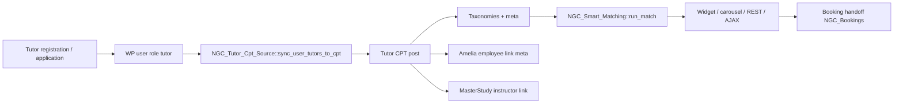

# Matching Data Flow

**Canonical source:** Tutor CPT (`post_type = tutors`) via `NGC_Tutor_Cpt_Source`.

## Pipeline

## Components

| Stage | Class / function | Notes |
|-------|------------------|-------|
| Demo seed | `NGC_Tutor_Seeder` | Sets `ngc_demo_seed = 1` |
| Live carousel | `bi_get_live_tutors()` | Theme reads CPT |
| Smart match | `NGC_Smart_Matching` | CPT scoring |
| Legacy DB match | `NGC_Matching::score_tutors()` | Delegates to CPT source |
| Repair | `wp ngc sync-tutors` | Links WP users → CPT |

## Legacy adapter

When CPT scoring returns no rows, `NGC_Tutor_Cpt_Source::score_legacy_wp_users()` scores WP `tutor` role users as fallback only.

## DEPRECATED

- Unified-repo `NGC_Marketplace` full CPT registration — **not ported**. REVAMP uses theme CPT + `NGC_Tutor_Seeder` + compatibility shortcode alias only.

## NOT VERIFIED

- Amelia employee auto-link on tutor approval
- MasterStudy instructor sync on publish
