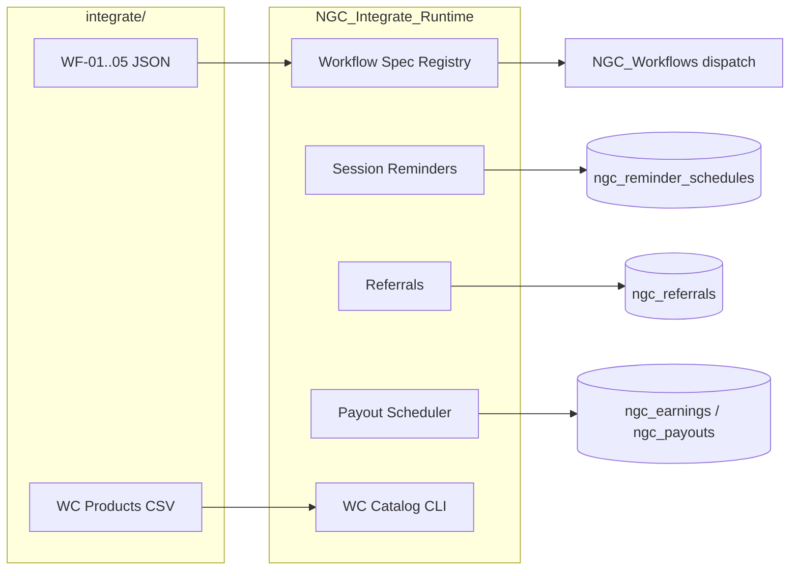

# NextGen Tutors — Integrate Pack: SWOT & Gap Analysis

**Package:** NextGenTutors-Companion v1.6.0  
**Scope:** `integrate/` folder → production `NGC_*` runtime  
**Date:** 2026-07-05

---

## Executive summary

The `integrate/` folder contained workflow JSON specs, a WooCommerce CSV, and a legacy standalone PHP orchestrator (`nextgentutors-workflows.php`) that used `ngt_*` tables and duplicated hooks. **v1.4.0 ports all five workflows into the main Companion plugin** with shared `ngc_*` schema, cron jobs, CLI, verification checks, and automated static tests.

**Production readiness:** Suitable for staged/UAT testing. Full enterprise hardening (idempotency keys, distributed cron locks, payment gateway webhooks) remains in the gap list below.

---

## SWOT analysis

### Strengths

| Area | Detail |
|------|--------|
| **Clear workflow specs** | Five JSON files (WF-01..WF-05) document events, triggers, and business intent |
| **Existing platform** | Companion already had orchestrator, bookings, payments, reviews, Amelia adapter, audit log, retry queue |
| **Unified schema** | `ngc_referrals`, `ngc_reminder_schedules` extend existing `ngc_*` tables — no parallel `ngt_*` DB |
| **Observability** | `NGC_Audit`, workflow dispatch events, `wp ngc integrate_status`, verification `integrate_pack` check |
| **Testability** | `scripts/integrate-test.php` + `scripts/validate.php` run without WordPress bootstrap |

### Weaknesses

| Area | Detail | Mitigation in v1.4.0 |
|------|--------|----------------------|
| Legacy orchestrator | 699-line duplicate with conflicting table names | Deprecated stub; runtime in `includes/integrations/*` |
| JSON not executable | Specs were documentation only | `NGC_Workflow_Spec_Registry` loads and verifies them |
| Amelia ID mismatch | Amelia booking IDs ≠ internal `ngc_bookings.id` | **Closed** — `amelia_booking_id` + `sync_from_amelia()` |
| Email delivery | Depends on `NGC_Email_Adapter` or `wp_mail` | Retry queue on failure; templates installed on bootstrap |

### Opportunities

| Area | Detail |
|------|--------|
| **CSV product seeder** | 17 WooCommerce SKUs ready via `wp ngc import_woocommerce_products` |
| **Referral ledger** | `?ref=` cookie + conversion on first payment |
| **Spec-driven admin** | Future: render WF JSON in Workflow Admin UI |
| **FluentCRM alignment** | Map `ngt.*` events to existing FluentCRM adapter tags |

### Threats

| Area | Detail | Risk |
|------|--------|------|
| Double-loading legacy file | Admin includes old orchestrator as mu-plugin | Duplicate hooks, split data | **Blocked** — deprecated stub exits unless `NGC_LOAD_LEGACY_ORCHESTRATOR` defined |
| Cron reliability | WP-Cron is request-driven | Missed reminders on low-traffic sites | Use system cron + `wp cron event run` |
| POPIA / consent | Referral cookies without explicit consent banner tie-in | Compliance gap | **Closed** — consent-gated `ngc_ref` + pending transient |
| WC not installed | CSV import fails without WooCommerce | Expected; CLI reports error clearly |

---

## Gap analysis

### Closed in v1.4.0 (was missing)

| Gap | Resolution |
|-----|------------|
| WF-03 session reminders | `NGC_Session_Reminders` — 24h/1h/15m queue + 5-min cron |
| WF-05 monthly payout cron | `NGC_Payout_Scheduler` — `ngc_monthly_payout_batch` |
| Referrals table + flow | `ngc_referrals` + `NGC_Referrals` |
| WooCommerce CSV import | `NGC_WooCommerce_Catalog` + CLI |
| Bootstrap wiring | `NGC_Integrate_Runtime` in plugin modules |
| `ngc_review_submitted` hook | Fired from `NGC_Reviews::create_review()` |
| Amelia status sync | `NGC_Bookings::update_status()` + Amelia bridge |
| Email templates | `session_reminder_24h`, `_1h`, `_15m` |
| CLI surface | `integrate_status`, `import_woocommerce_products`, `run_payout_batch`, `process_reminders` |
| Static test suite | `scripts/integrate-test.php` |
| Legacy deprecation | `nextgentutors-workflows.php` stub |

### Remaining gaps (post-v1.6.0)

| Priority | Gap | Status |
|----------|-----|--------|
| **P1** | Real cron on production | Documented — `docs/operations/production-cron.md` |
| **P2** | Amelia ↔ `ngc_bookings` ID mapping | **Closed** — `amelia_booking_id` column + `sync_from_amelia()` |
| **P2** | Referral cookie + POPIA | **Closed** — consent-gated `ngc_ref` + pending transient |
| **P2** | Reminder idempotency | **Closed** — unique `booking_reminder` index + insert guard |
| **P2** | REST wallet/invoices/matches | **Closed** — `NGC_Rest_Finance` + GET `/matches` |
| **P2** | Studio dashboard placeholders | **Closed** — live widget renderers |
| **P3** | WC category assignment from CSV | **Closed** — `assign_product_categories()` from `Categories` column |
| **P3** | Payout gateway integration | **Closed** — pending payouts + PayFast CSV export + `confirm_payout` |
| **P3** | Full PHPUnit suite | Partial — `tests/run.php` unit tests + `e2e-docker.php` smoke |
| **P3** | Html-Importer validate.php | **Closed** — `NextGenTutors-Html-Importer/scripts/validate.php` |

---

## Test report (static suite)

Run from plugin root:

```bash
php scripts/validate.php      # PHP lint + required files + integrate-test + smoke
php scripts/integrate-test.php # Integrate-specific assertions only
# Docker E2E (requires running container):
docker exec nextgentutors-wordpress-1 php /var/www/html/wp-cli.phar eval-file \
  /var/www/html/wp-content/plugins/NextGenTutors-Companion/scripts/e2e-docker.php --allow-root
```

### Bugs found and fixed (this pass)

| ID | Severity | Issue | Fix |
|----|----------|-------|-----|
| BUG-001 | **High** | `NGC_Bookings::update_status()` did not exist; Amelia bridge fatal | Added `update_status()` + `status` field in `update()` |
| BUG-002 | **High** | Session reminders read `$row->starts_at` (wrong column) | Use `$row->scheduled_at` |
| BUG-003 | **Medium** | Double `review.submitted` workflow dispatch | Single path via `ngc_review_submitted` → `NGC_Integrate_Runtime` |
| BUG-004 | **Medium** | Integrate modules not bootstrapped | `NGC_Integrate_Runtime` in `$modules` |
| BUG-005 | **Low** | Legacy orchestrator could be loaded alongside plugin | Deprecated stub with `E_USER_DEPRECATED` |
| BUG-006 | **Low** | Missing reminder email templates | Added WF-03 templates |
| BUG-007 | **Low** | `validate.php` missing integrate files/tables | Extended required list + `integrate-test.php` hook |

---

## Recommended UAT test plan

1. `wp plugin list` — confirm Companion **1.6.0** active  
2. `wp ngc integrate_status` — all specs OK, crons scheduled after one page load  
3. `wp ngc verify` — `integrate_pack` = PASS (or WARNING before first `init`)  
4. Create booking (Amelia or internal) → confirm rows in `wp_ngc_reminder_schedules`  
5. `wp ngc process_reminders` — pending rows move to `sent` or `failed`  
6. Submit review via REST/dashboard → `ngt.review.submitted` in workflow runs  
7. `wp ngc import_woocommerce_products --dry-run` — 17 products preview  
8. `wp ngc run_payout_batch` — processes pending earnings (with test data)  

---

## Architecture (post-integration)



---

*Generated as part of integrate pack delivery. Re-run `php scripts/integrate-test.php` after any change to `integrate/` or `includes/integrations/`.*
