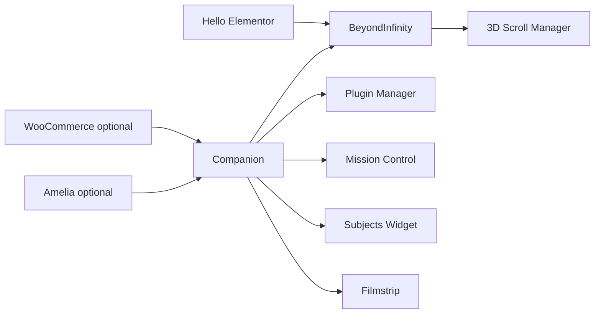

# Dependency map

See `../04-VALIDATION/DEPENDENCY-MATRIX.csv`.

Required runtime: WordPress + Hello Elementor + Companion + BeyondInfinity + visual plugins. Optional: Woo/Amelia/LMS/CRM, AI Integration, BeyondMeasure. Avoid Automation Hub when Companion is active.