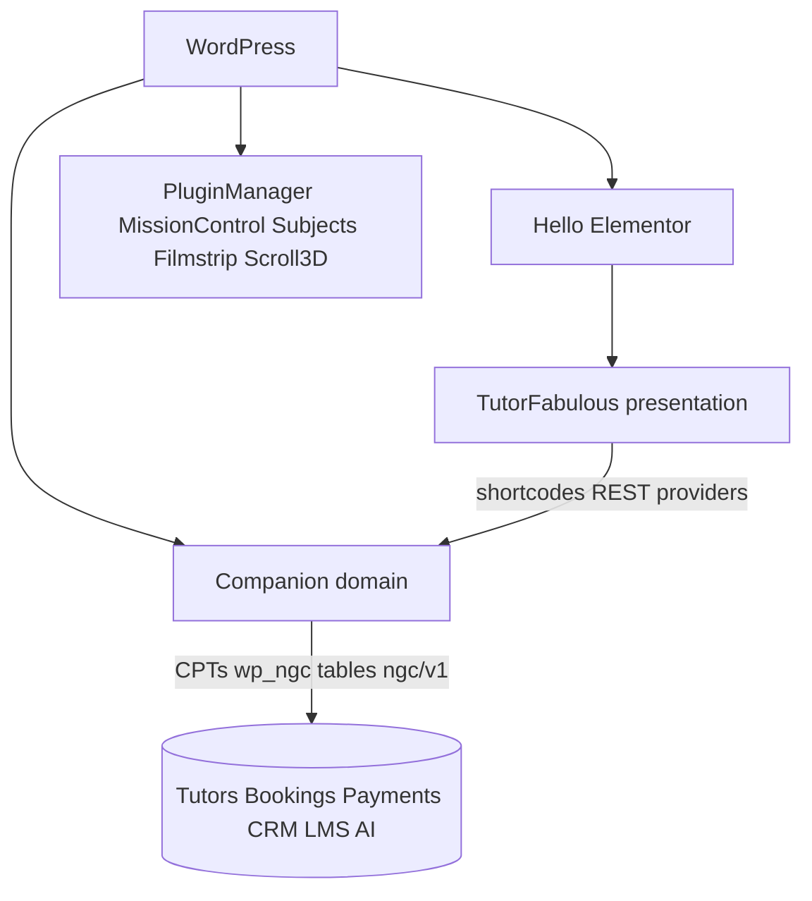

# System architecture

Release train 2026.09.12. Live code roots: TutorFabulous theme (`BI_VERSION` 2.1.1; BeyondInfinity = legacy package name / train ZIP label 1.9.29), Companion 1.9.22.

## Ownership

| Concern | Owner |
|---|---|
| Templates, header/footer, kinetic, GSAP chrome | Theme |
| CPT `tutors`, `testimonials`, `resources` | Companion |
| `wp_ngc_*` tables | Companion |
| REST `ngc/v1` (+ alias `ngt/v1`) | Companion |
| REST `ngt3d/v1` | 3D Scroll Manager |
| REST `bi/v1` OpenWA | Theme (this release) |
| Roles/caps | Companion `NGC_Roles` (theme stubs if Companion absent) |

Narrow contracts: shortcodes `ngc_*`, REST `ngc/v1`, UI providers, `bi_companion_active()`.