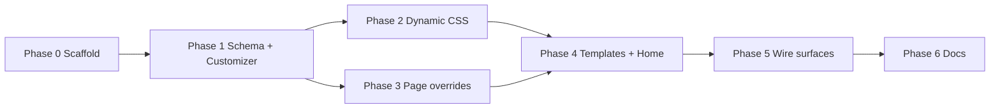

# SmartHead-Style Configuration — Implementation Plan

**Target theme:** `beyondinfinity` v1.4.0+  
**Prerequisite doc:** `SMARTHEAD-CONFIG-DIFFERENCES.md`  
**Approval gate:** Do not merge until stakeholder approves scope.

---

## Guiding principles

1. **Schema once, use everywhere** — Customizer, getters, overrides, and docs read the same array.
2. **Presentation only** — No companion data, CPT logic, or REST in the config layer.
3. **Incremental** — Each phase ships usable value; no big-bang rewrite.
4. **BI conventions** — `bi_` prefix, `inc/config/`, filters over inheritance trees.
5. **Builder-safe** — `bi_render_page_template()` behavior preserved unless explicitly overridden.

---

## Phase 0 — Scaffold & migration (½ day)

**Goal:** Foundation without visible UI changes.

| Task | Files |
|------|-------|
| Create `inc/config/storage.php` | Port minimal API from SmartHead storage |
| Create `inc/config/options-get.php` | `bi_get_theme_option()`, `bi_is_inherit()` |
| Create `inc/config/options-loader.php` | Hydrate schema defaults + `theme_mod` |
| Require from `functions.php` | After `tutor-data.php`, before templates |
| Migrate existing Customizer keys | Map `bi_phone`, `bi_email`, … into schema |

**Acceptance:**
- `bi_get_theme_option('bi_phone')` returns same value as `get_theme_mod('bi_phone')`
- PHPUnit or smoke: `php -l` on all new files

---

## Phase 1 — Declarative schema + Customizer bridge (1 day)

**Goal:** Replace hand-written Customizer with schema-driven controls.

| Task | Detail |
|------|--------|
| `inc/config/options-schema.php` | Panels: Brand, Contact, Layout, Homepage, Tutoring |
| `inc/config/lists.php` | `bi_get_list_yesno()`, `bi_get_list_header_styles()`, … |
| `inc/config/customizer-bridge.php` | Loop schema → `$wp_customize->add_setting/control` |
| Refactor `inc/customizer.php` | Thin wrapper or deprecate (require bridge only) |
| Filter `bi_filter_options_schema` | Document for companion hooks |

**Schema v1 fields (global):**

```text
Brand
  color_scheme          select   default|ocean|midnight
  custom_logo_retina   checkbox

Contact (migrate existing)
  bi_phone, bi_email, bi_support_email, bi_whatsapp, …

Layout
  header_style          select   default|transparent|minimal
  footer_style          select   default|minimal
  body_style            select   wide|boxed
  show_whatsapp_fab     checkbox

Homepage (front page)
  home_layout           select   kinetic|classic
  home_section_trust    checkbox
  home_section_subjects checkbox
  home_section_tutors   checkbox
  home_section_reviews  checkbox
  home_section_faq      checkbox

Tutoring
  rate_online           number   320
  rate_inperson         number   350
  rate_tertiary         number   500
  guarantee_code        text     NEXTGEN100
```

**Acceptance:**
- Appearance → Customize shows all panels
- Saving Customizer updates `bi_get_theme_option()` values
- Existing sites: no data loss on `bi_*` mods

---

## Phase 2 — Dynamic CSS tokens (1 day)

**Goal:** Admin color scheme changes rebrand without editing `style.css`.

| Task | Detail |
|------|--------|
| `inc/config/color-schemes.php` | 3 schemes → token map |
| `inc/config/theme-styles.php` | Generate `:root { --ngt-primary: … }` |
| Hook `wp_head` priority 99 | Enqueue inline or cached file |
| Hook `customize_save_after` | Regenerate cache |
| `bi_customizer_preview_js` | Live preview color swap (optional min) |

**Acceptance:**
- Switching scheme in Customizer updates hero/button colors on front page
- Kinetic home inherits `--ngt-*` where applicable

---

## Phase 3 — Per-page overrides (1–1½ days)

**Goal:** SmartHead-style inherit/custom per post.

| Task | Detail |
|------|--------|
| `inc/config/override-metabox.php` | Metabox UI for override-flagged options |
| `assets/js/bi-options-admin.js` | Inherit lock + dependency show/hide |
| Save handler `save_post` | `bi_options` post meta |
| Extend `bi_get_theme_option()` | Read meta on singular |
| `bi_filter_allow_override_options` | pages + tutors CPT |
| Registry defaults | Dashboard slugs default `header_style=minimal` |

**Override-flagged fields (v1):**

- `show_page_title`
- `header_style`
- `body_style`
- `hide_whatsapp_fab`
- `force_theme_default` (bypass builder when checked)

**Acceptance:**
- Edit Find a Tutor page → set header transparent → front reflects change
- Inherit lock restores global Customizer value
- Elementor canvas pages ignore header options (documented)

---

## Phase 4 — Template router + homepage integration (1 day)

**Goal:** Options drive templates and kinetic sections.

| Task | Detail |
|------|--------|
| `templates/header/default.php` | Extract from `header.php` |
| `templates/header/transparent.php` | New variant |
| `templates/header/minimal.php` | Dashboard variant |
| `templates/footer/*` | Same pattern |
| Update `header.php` / `footer.php` | Router only |
| Update `inc/defaults/home.php` | Wrap sections in `bi_home_section_enabled( $id )` |
| `inc/config/home-sections.php` | Section registry + filter |

**Acceptance:**
- Disable `home_section_reviews` in Customizer → testimonials block hidden
- Parent dashboard uses minimal header via registry default
- Preview HTML still buildable

---

## Phase 5 — Wiring existing BI surfaces (½ day)

**Goal:** Replace hardcoded values with getters.

| Surface | Change |
|---------|--------|
| `inc/defaults/pricing.php` | Rates from `bi_get_theme_option('rate_online')` |
| `inc/defaults/home.php` | Stats/CTA text filters |
| `footer.php` | Contact from getter (already partial) |
| `inc/template-tags.php` | WhatsApp FAB respects `show_whatsapp_fab` + per-page hide |
| `inc/seo.php` | Optional meta overrides from schema |
| `inc/pages-registry.php` | Add `config_defaults` key per slug |
| Admin sync screen | Show recommended overrides per page type |

**Acceptance:**
- Change rate in Customizer → pricing page updates on theme fallback
- Touchpoint audit table includes config column

---

## Phase 6 — Documentation & preview (½ day)

| Task | Detail |
|------|--------|
| Update `CHANGES-REGISTRY.md` | Log config layer |
| Update `KNOWN-LIMITATIONS.md` | Elementor vs options |
| Customizer export note | `theme_mod` backup |
| Static preview | Optional `config` query args for preview build |

---

## Implementation order & dependencies



**Total estimate:** 5–6 days focused work  
**Minimum viable slice (if time-boxed):** Phases 0–1–3 (schema + customizer + page overrides)

---

## Testing plan

| Area | Test |
|------|------|
| Getter cascade | Unit: meta > mod > std |
| Customizer save | All field types sanitize correctly |
| Override metabox | Inherit/custom on 3 page types |
| Builder coexistence | Elementor page unchanged; empty page uses default |
| Dashboard guards | Role pages still redirect correctly |
| Performance | Cached CSS file < 5KB |
| a11y | Customizer controls have labels; contrast on schemes |
| Regression | `php -l` all `inc/config/*`; spot-check 5 launch pages |

---

## Rollback strategy

- Config layer is additive; remove `require inc/config/*` to revert to current Customizer
- `theme_mod` keys unchanged — no DB migration required
- `bi_options` post meta is optional; deleting metabox does not break pages

---

## Approval checklist

**Status:** Approved and implemented (Phases 0–6) in v1.4.0.

- [x] Full plan (Phases 0–6)
- [ ] MVP only (Phases 0–1–3)
- [ ] Adjust scope: _______________
