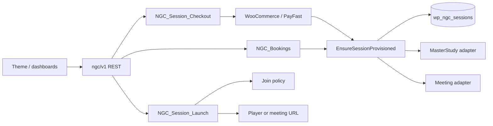

# Session → Commerce → Launch

**Last Updated:** 2026-09-17  
**Code:** `NextGenTutors-Companion/includes/session/`  
**REST:** `ngc/v1/sessions/{id}/*`, `ngc/v1/bookings/{id}/join`

NGT Session is the orchestration truth. Booking owns the slot, WooCommerce owns payment/invoice, MasterStudy owns the lesson, the meeting adapter owns realtime. `EnsureSessionProvisioned` is the only provision command.

## Context



## Key modules

| Class | Responsibility |
|-------|----------------|
| `NGC_Ensure_Session_Provisioned` | Idempotent provision: session row, invoice, LMS, meeting, CRM, audit |
| `NGC_Session_Checkout` | Cart + parent checkout share `prepare_order_args()` + price integrity |
| `NGC_Session_Price_Integrity` | Server catalogue price, tutor/subject/duration match |
| `NGC_Product_Catalog` | Official 16 SKUs + `_ngt_product_key` on Woo products |
| `NGC_Session_Presenter` | Dashboard rows **without** join URLs |
| `NGC_Session_Launch` | Only authorized URL issuer (join window + payment) |
| `NGC_Rest_Bookings` | CRUD redacts `meta.meeting.join_url`; `/join` uses launch |
| `NGC_Rest_Sessions` | `POST /sessions/{id}/launch` |

## REST contracts

| Method | Route | Join URL in body? |
|--------|-------|-------------------|
| GET | `/ngc/v1/bookings`, `/bookings/{id}` | **No** — secrets redacted |
| GET/POST | `/ngc/v1/bookings/{id}/join` | Yes, after policy |
| GET | `/ngc/v1/sessions/{id}` | **No** — presenter blanks URLs |
| POST | `/ngc/v1/sessions/{id}/launch` | Yes, after policy |

Dashboard JS must call **launch**, never render `joinUrl` from list payloads.

## Checkout integrity

1. Client may send booking/tutor/student/subject/schedule — **not** price or join URL.
2. `collect_untrusted_context()` allow-lists those fields.
3. `prepare_order_args()` resolves SKU from the catalogue, billing identity, and `NGC_Session_Price_Integrity::validate()`.
4. Woo cart add-to-cart and line-item stamp call the same path as parent REST checkout.
5. Order item meta snapshots (`_ngt_tutor_id`, `_ngt_subject_id`, `_ngt_product_key`, …) are written only from the validated result.

## Join policy (server)

Denied reasons: `too_early`, `too_late`, `payment_required`, plus participant authorization. Window is **not** a UI-only countdown.

## Tests

```bash
php NextGenTutors-Companion/tests/run-session-unit.php
```

E2E: `e2e/workflows/booking-commerce-session-lesson.spec.ts`

## Related

- [companion-domain.md](companion-domain.md)
- [platform.md](platform.md)
- `delivery/BOOKING-COMMERCE-IMPLEMENTATION-REPORT.md`
