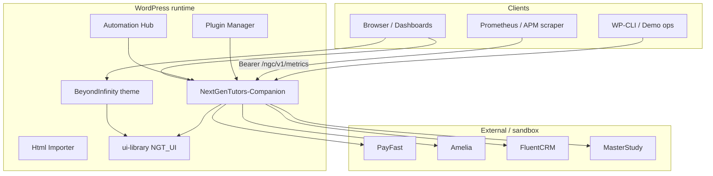
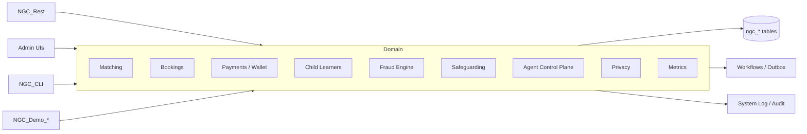

# NextGen Tutors — Platform Architecture Reference

**Audience:** architects, senior engineers, onboarding  
**Status:** Living document (2026-07-20)  
**Code roots:** Companion `1.9.x`, BeyondInfinity theme, `ui-library`, Automation Hub

---

## 1. Executive summary

NextGen Tutors is a WordPress-centred tutoring platform for South African online / in-person / hybrid lessons. **NextGenTutors-Companion** owns the domain model (`ngc_*` tables), REST (`ngc/v1`), workflows, payments (PayFast sandbox/live), fraud/safeguarding, governed AI agents, privacy retention, metrics export, and Phase 14 relational demo seeding. The **BeyondInfinity** theme and **ui-library** own presentation. Legacy Content-Enhancement plugins are blocked by `NGC_Legacy_Plugin_Guard`.

**Why this shape:** keep a single source of truth for bookings/money/minors, while allowing Magic UI + editor adapters without dual business logic.

---

## 2. System context



| Component | Path | Responsibility |
|-----------|------|----------------|
| Theme | `NextGenTutors-BeyondInfinity/` | Pages, defaults, prototypes |
| Companion | `NextGenTutors-Companion/` | Domain, REST, agents, demo, privacy, metrics |
| UI library | `ui-library/` | Magic UI catalog + renderer |
| Hub | `nextgen-automation-hub/` | Automation events (defers payouts when Companion scheduler present) |
| Plugin Manager | `NextGenTutors-Plugin-Manager/` | Install/update; respects `is_denied()` |
| Html Importer | `NextGenTutors-Html-Importer/` | Content import only |

---

## 3. Companion internal architecture



Bootstrap: `NGC_Plugin_Bootstrap::$modules` in `includes/class-ngc-plugin.php` calls `::init()` on each module after PSR-style autoload (`ngc_autoload` in `nextgencompanion.php`).

### 3.1 Design decisions (why)

| Decision | Rationale |
|----------|-----------|
| Companion owns `ngc_*` domain | Avoid CE plugin dual-schema conflicts |
| Legacy plugin guard | Prevent REST/DB breakage from archived zips |
| Dual UI bridge (option-centric) | Keep demos + Magic UI without forced deprecation |
| Demo seed via domain services | Phase 14 — real triggers, not fake dashboard JSON |
| Metrics Prometheus + webhook | OBS-001 without locking to one APM vendor |
| WP privacy exporters + retention cron | PRIV-001 for minor PII / POPIA-aligned ops |

---

## 4. Core domain flows

### 4.1 Match → book → pay → complete

```text
Find tutor → NGC_Matching::create_from_find_tutor
  → match.proposed workflow
  → accept / manual_assign
  → NGC_Bookings::create (conflict check)
  → booking.created
  → PayFast / wallet settle → NGC_Payments::settle_order
  → transition confirmed → completed
  → lesson.completed → earnings / review request
```

### 4.2 Minor (child learner) path

```text
Parent user → NGC_Child_Learners::create
  → optional provision_wp_user (child_learner role)
  → match/book with student_user_id
  → PRIV-001 export/erase via WP Tools + NGC_Privacy
```

### 4.3 Governed agents

```text
NGC_Agent_Control_Plane::request_action
  → NGC_Agent_Policy_Engine::evaluate (ALLOW | DENY | REQUIRE_APPROVAL)
  → decide_approval / execute_task
  → audit + kill switch (ngc_agent_global_pause)
```

Autonomy levels remain observe/recommend/case by default — not unsupervised production mutation.

---

## 5. Cross-cutting concerns

### 5.1 Security

- `NGC_Access` object-level checks on bookings/matches
- PayFast ITN amount/merchant/replay hardening
- Rate limiting on public REST
- Demo login-as only for `ngc_is_demo_user` while demo mode on

### 5.2 Privacy (PRIV-001)

| Capability | Class |
|------------|-------|
| WP exporters/erasers | `NGC_Privacy` |
| Retention sweep | `ngc_privacy_retention_tick` |
| Admin UI | Platform → Privacy / Consent / Minor PII |

Labels: anonymize child learners; purge aged analytics/logs when enabled.

### 5.3 Observability (OBS-001)

| Capability | Class / route |
|------------|---------------|
| Counters + gauges | `NGC_Metrics` |
| Prometheus | `GET /wp-json/ngc/v1/metrics` |
| JSON twin | `/ngc/v1/metrics/json` |
| Webhook push | hourly cron + admin “Push now” |
| Alert hook | `ngc_metrics_alert` (throttled) |

### 5.4 Demo environment (Phase 14)

| Capability | Class |
|------------|-------|
| Safety flags | `NGC_Demo_Env` |
| Clock | `NGC_Demo_Clock` |
| Personas | `NGC_Demo_Registry` |
| Seed | `NGC_Demo_Seeder` |
| Verify / reset | `NGC_Demo_Verifier` / `NGC_Demo_Reset` |
| Control Centre | `NGC_Demo_Admin` |

Ops guide: [../.agent-audit/demo/README.md](../.agent-audit/demo/README.md)  
Tutorial: [tutorials/01-phase14-demo-walkthrough.md](./tutorials/01-phase14-demo-walkthrough.md)

---

## 6. Data model (high level)

Primary tables via `NGC_Database::table_names()`:

`matches`, `bookings`, `invoices`, `wallet_ledger`, `payouts`, `reviews`, `audit_log`, `child_learners`, `system_log`, `consent_log`, `analytics_events`, plus agent/fraud/safeguarding/outbox tables installed by their modules.

Demo entities carry meta:

```text
is_demo = true
demo_scenario_id = <id>
demo_seed_version = 14.0.0
```

---

## 7. Deployment topology (local)

| Service | Port (typical) |
|---------|----------------|
| WordPress | `http://localhost:8900` |
| MySQL 8 | internal Docker network |
| phpMyAdmin | loopback-bound (`PMA_BIND=127.0.0.1`) |

Secrets: never commit `docker/.env`. Rotate any credentials that lived only in local compose.

---

## 8. Reading paths

| Role | Start with |
|------|------------|
| New engineer | This doc → [ui-library-guide.md](./ui-library-guide.md) → Companion `tests/run.php` |
| Evaluator / QA | [tutorials/01-phase14-demo-walkthrough.md](./tutorials/01-phase14-demo-walkthrough.md) |
| Security / privacy | [ops-privacy-observability.md](./ops-privacy-observability.md) + guard runbook |
| API consumer | [api-reference-ngc-v1.md](./api-reference-ngc-v1.md) |

---

## 9. Related ADRs & status

- [ADR-001 Legacy plugin deny](./adr/ADR-001-legacy-plugin-deny.md)
- [ADR-002 Dual UI coexistence](./adr/ADR-002-dual-ui-coexistence.md)
- [master-directive-status.md](./master-directive-status.md)
- `.agent-audit/20-production-readiness.md`
